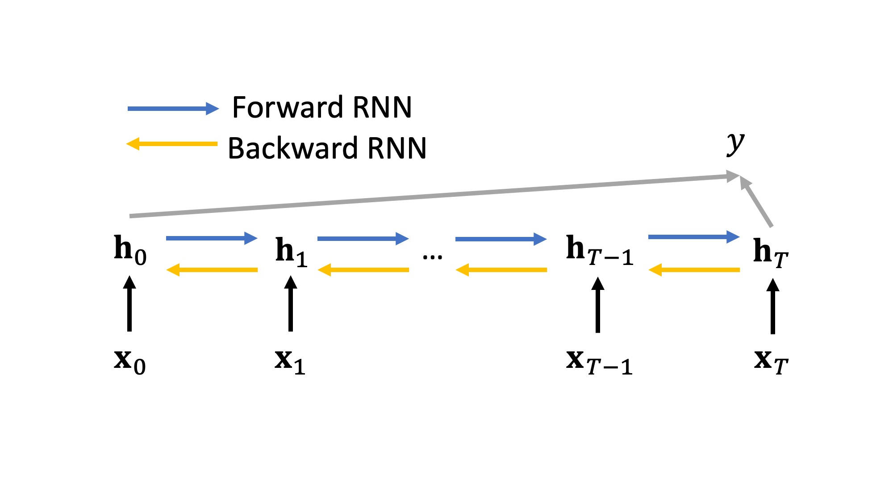

# HW3 Recurent Neural Network

## Overview

In this homework, you will build a bi-directional RNN on diagnosis codes. The recurrent nature of RNN allows us to model the temporal relation of different visits of a patient. More specifically, we will still perform **Heart Failure Prediction**, but with different input formats.

---


```python
import os
import sys
import pickle
import random
import numpy as np
import torch
import torch.nn as nn
import torch.nn.functional as F

# set seed
seed = 24
random.seed(seed)
np.random.seed(seed)
torch.manual_seed(seed)
os.environ["PYTHONHASHSEED"] = str(seed)

# Define data path
DATA_PATH = "../HW3_RNN-lib/data"
```

---

## About Raw Data

To get started, we will implement a naive RNN model for heart failure prediction using the diagnosis codes.

We will use the same dataset synthesized from [MIMIC-III](https://mimic.physionet.org/gettingstarted/access/), but with different input formats.

The data has been preprocessed for you. Let us load them and take a look.


```python
pids = pickle.load(open(os.path.join(DATA_PATH,'train/pids.pkl'), 'rb'))
vids = pickle.load(open(os.path.join(DATA_PATH,'train/vids.pkl'), 'rb'))
hfs = pickle.load(open(os.path.join(DATA_PATH,'train/hfs.pkl'), 'rb'))
seqs = pickle.load(open(os.path.join(DATA_PATH,'train/seqs.pkl'), 'rb'))
types = pickle.load(open(os.path.join(DATA_PATH,'train/types.pkl'), 'rb'))
rtypes = pickle.load(open(os.path.join(DATA_PATH,'train/rtypes.pkl'), 'rb'))

assert len(pids) == len(vids) == len(hfs) == len(seqs) == 1000
assert len(types) == 619
```

where

- `pids`: contains the patient ids
- `vids`: contains a list of visit ids for each patient
- `hfs`: contains the heart failure label (0: normal, 1: heart failure) for each patient
- `seqs`: contains a list of visit (in ICD9 codes) for each patient
- `types`: contains the map from ICD9 codes to ICD-9 labels
- `rtypes`: contains the map from ICD9 labels to ICD9 codes

Let us take a patient as an example.


```python
# take the 3rd patient as an example

print("Patient ID:", pids[3])
print("Heart Failure:", hfs[3])
print("# of visits:", len(vids[3]))
for visit in range(len(vids[3])):
    print(f"\t{visit}-th visit id:", vids[3][visit])
    print(f"\t{visit}-th visit diagnosis labels:", seqs[3][visit])
    print(f"\t{visit}-th visit diagnosis codes:", [rtypes[label] for label in seqs[3][visit]])
```

Note that `seqs` is a list of list of list. That is, `seqs[i][j][k]` gives you the k-th diagnosis codes for the j-th visit for the i-th patient.

And you can look up the meaning of the ICD9 code online. For example, `DIAG_276` represetns *disorders of fluid electrolyte and acid-base balance*.

Further, let see number of heart failure patients.


```python
print("number of heart failure patients:", sum(hfs))
print("ratio of heart failure patients: %.2f" % (sum(hfs) / len(hfs)))
```

Now we have the data. Let us build the naive RNN.

## 1 Build the dataset [30 points]

### 1.1 CustomDataset [5 points]

First, let us implement a custom dataset using PyTorch class `Dataset`, which will characterize the key features of the dataset we want to generate.

We will use the sequences of diagnosis codes `seqs` as input and heart failure `hfs` as output.


```python
from torch.utils.data import Dataset
import random

class CustomDataset(Dataset):
    
    def __init__(self, seqs, hfs):
        
        """
        TODO: Store `seqs`. to `self.x` and `hfs` to `self.y`.
        
        Note that you DO NOT need to covert them to tensor as we will do this later.
        Do NOT permute the data.
        """
        
        # your code here
        self.x = seqs
        self.y = hfs
    
    def __len__(self):
        
        """
        TODO: Return the number of samples (i.e. patients).
        """
        
        # your code here
        return len(self.x)
    
    def __getitem__(self, index):
        
        """
        TODO: Generates one sample of data.
        
        Note that you DO NOT need to covert them to tensor as we will do this later.
        """
        
        # your code here
        x = self.x[index]
        y = self.y[index]
        return x, y
        
        

dataset = CustomDataset(seqs, hfs)
```


```python
'''
AUTOGRADER CELL. DO NOT MODIFY THIS.
'''

dataset = CustomDataset(seqs, hfs)

assert len(dataset) == 1000


```

### 1.2 Collate Function [20 points]

As you note that, we do not convert the data to tensor in the built `CustomDataset`. Instead, we will do this using a collate function `collate_fn()`. 

This collate function `collate_fn()` will be called by `DataLoader` after fetching a list of samples using the indices from `CustomDataset` to collate the list of samples into batches.

For example, assume the `DataLoader` gets a list of two samples.

```
[ [ [0, 1, 2], [8, 0] ], 
  [ [12, 13, 6, 7], [12], [23, 11] ] ]
```

where the first sample has two visits `[0, 1, 2]` and `[8, 0]` and the second sample has three visits `[12, 13, 6, 7]`, `[12]`, and `[23, 11]`.

The collate function `collate_fn()` is supposed to pad them into the same shape (3, 4), where 3 is the maximum number of visits and 4 is the maximum number of diagnosis codes.

``` 
[ [ [0, 1, 2, *0*], [8, 0, *0*, *0*], [*0*, *0*, *0*, *0*]  ], 
  [ [12, 13, 6, 7], [12, *0*, *0*, *0*], [23, 11, *0*, *0*] ] ]
```

Further, the padding information will be stored in a mask with the same shape, where 1 indicates that the diagnosis code at this position is from the original input, and 0 indicates that the diagnosis code at this position is the padded value.

```
[ [ [1, 1, 1, 0], [1, 1, 0, 0], [0, 0, 0, 0] ], 
  [ [1, 1, 1, 1], [1, 0, 0, 0], [1, 1, 0, 0] ] ]
```

Lastly, we will have another diagnosis sequence in reversed time. This will be used in our RNN model for masking. Note that we only flip the true visits.

``` 
[ [ [8, 0, *0*, *0*], [0, 1, 2, *0*], [*0*, *0*, *0*, *0*]  ], 
  [ [23, 11, *0*, *0*], [12, *0*, *0*, *0*], [12, 13, 6, 7] ] ]
```

And a reversed mask as well.

```
[ [ [1, 1, 0, 0], [1, 1, 1, 0], [0, 0, 0, 0] ], 
  [ [1, 1, 0, 0], [1, 0, 0, 0], [1, 1, 1, 1], ] ]
```

We need to pad the sequences into the same length so that we can do batch training on GPU. And we also need this mask so that when training, we can ignored the padded value as they actually do not contain any information.


```python
import itertools
ls = [ [ [0, 1, 2], [8, 0] ], 
  [ [12, 13, 6, 7], [12], [23, 11] ] ]
max_num_visits = 3
max_num_codes = 4
tmp = [[7, 1], [8, 4, 0], [9]]
tmp = torch.LongTensor(list(map(lambda x: x + [0] * (max(map(len, tmp)) - len(x)), tmp)))
tmp
```


```python
import torch.nn.functional as F
def collate_fn(data):
    """
    TODO: Collate the the list of samples into batches. 
    For each patient, you need to pad the diagnosis
        sequences to the sample shape (max # visits, max # diagnosis codes). 
        The padding infomation
        is stored in `mask`.
    
    Arguments:
        data: a list of samples fetched from `CustomDataset`
        
    Outputs:
        x: a tensor of shape (# patiens, max # visits, max # diagnosis codes) of type torch.long
        masks: a tensor of shape (# patiens, max # visits, max # diagnosis codes) of type torch.bool
        rev_x: same as x but in reversed time. This will be used in our RNN model for masking 
        rev_masks: same as mask but in reversed time. This will be used in our RNN model for masking
        y: a tensor of shape (# patiens) of type torch.float
        
    Note that you can obtains the list of diagnosis codes and the list of hf labels
        using: `sequences, labels = zip(*data)`
    """

    sequences, labels = zip(*data)

   
    
    num_patients = len(sequences)
    num_visits = [len(patient) for patient in sequences]
    num_codes = [len(visit) for patient in sequences for visit in patient]

    max_num_visits = max(num_visits)
    max_num_codes = max(num_codes)
    
    x = torch.zeros((num_patients, max_num_visits, max_num_codes), dtype=torch.long)
    masks = torch.zeros((num_patients, max_num_visits, max_num_codes), dtype=torch.bool)
    rev_x = torch.zeros((num_patients, max_num_visits, max_num_codes), dtype=torch.long)
    rev_masks = torch.zeros((num_patients, max_num_visits, max_num_codes), dtype=torch.bool)
    y = torch.tensor(labels, dtype=torch.float)
    for i_patient, patient in enumerate(sequences):
        for j_visit, visit in enumerate(patient):
            """
            TODO: update `x`, `rev_x`, `masks`, and `rev_masks`
            """
            # your code here
            pad = max_num_codes - len(visit)
            padded_visit = torch.concat((
                    torch.tensor(visit),
                    torch.zeros(pad)
            )).long()
            
            x[i_patient, j_visit, :] = padded_visit.clone()
            masks[i_patient, j_visit, :] =  torch.where(padded_visit != 0, True, False)

    
    for i_patient, patient in enumerate(sequences):
        
        idx_all_real_visits = torch.sum(x[i_patient, :, :], dim=(1))!= 0
        idx_padded_visits =torch.sum(x[i_patient, :, :], dim=(1))== 0
        fliped = torch.flip(x[i_patient, idx_all_real_visits, :].unsqueeze(1), (0,)).squeeze(1)
        rev_x[i_patient, :, :] = torch.concat((
                                    fliped,
                                    x[i_patient, idx_padded_visits, :]
                                    ))
        rev_masks[i_patient, :, :] = torch.where(rev_x[i_patient, :, :] != 0, True, False)

    return x, masks, rev_x, rev_masks, y
```


```python
'''
AUTOGRADER CELL. DO NOT MODIFY THIS.
'''

from torch.utils.data import DataLoader

loader = DataLoader(dataset, batch_size=10, collate_fn=collate_fn)
loader_iter = iter(loader)
x, masks, rev_x, rev_masks, y = next(loader_iter)

assert x.dtype == rev_x.dtype == torch.long
assert y.dtype == torch.float
assert masks.dtype == rev_masks.dtype == torch.bool

assert x.shape == rev_x.shape == masks.shape == rev_masks.shape == (10, 3, 24)
assert y.shape == (10,)


```

Now we have `CustomDataset` and `collate_fn()`. Let us split the dataset into training and validation sets.


```python
from torch.utils.data.dataset import random_split

split = int(len(dataset)*0.8)

lengths = [split, len(dataset) - split]
train_dataset, val_dataset = random_split(dataset, lengths)

print("Length of train dataset:", len(train_dataset))
print("Length of val dataset:", len(val_dataset))
```

### 1.3 DataLoader [5 points]

Now, we can load the dataset into the data loader.


```python
from torch.utils.data import DataLoader

def load_data(train_dataset, val_dataset, collate_fn):
    
    '''
    TODO: Implement this function to return the data loader for  train and validation dataset. 
    Set batchsize to 32. Set `shuffle=True` only for train dataloader.
    
    Arguments:
        train dataset: train dataset of type `CustomDataset`
        val dataset: validation dataset of type `CustomDataset`
        collate_fn: collate function
        
    Outputs:
        train_loader, val_loader: train and validation dataloaders
    
    Note that you need to pass the collate function to the data loader `collate_fn()`.
    '''
    
    batch_size = 32
    # your code here
    train_loader = DataLoader(train_dataset, batch_size=batch_size, collate_fn = collate_fn, shuffle=True)
    val_loader = DataLoader(val_dataset, batch_size=batch_size, collate_fn = collate_fn, shuffle = False)
    
    
    return train_loader, val_loader


train_loader, val_loader = load_data(train_dataset, val_dataset, collate_fn)
```


```python
'''
AUTOGRADER CELL. DO NOT MODIFY THIS.
'''

train_loader, val_loader = load_data(train_dataset, val_dataset, collate_fn)

assert len(train_loader) == 25, "Length of train_loader should be 25, instead we got %d"%(len(train_loader))


```

## 2 Naive RNN [35 points] 

Let us implement a naive bi-directional RNN model.



Remember from class that, first of all, we need to transform the diagnosis code for each visit of a patient to an embedding. To do this, we can use `nn.Embedding()`, where `num_embeddings` is the number of diagnosis codes and `embedding_dim` is the embedding dimension.

Then, we can construct a simple RNN structure. Each input is this multi-hot vector. At the 0-th visit, this has $\boldsymbol{X}_0$, and at t-th visit, this has $\boldsymbol{X}_t$.

Each one of the input will then map to a hidden state $\boldsymbol{\overleftrightarrow{h}}_t$. The forward hidden state $\boldsymbol{\overrightarrow{h}}_t$ can be determined by $\boldsymbol{\overrightarrow{h}}_{t-1}$ and the corresponding current input $\boldsymbol{X}_t$.

Similarly, we will have another RNN to process the sequence in the reverse order, so that the hidden state $\boldsymbol{\overleftarrow{h}}_t$ is determined by $\boldsymbol{\overleftarrow{h}}_{t+1}$ and $\boldsymbol{X}_t$.

Finally, once we have the $\boldsymbol{\overrightarrow{h}}_T$ and $\boldsymbol{\overleftarrow{h}}_{0}$, we will concatenate the two vectors as the feature vector and train a NN to perform the classification.

Now, let us build this model. The forward steps will be:

    1. Pass the sequence through the embedding layer;
    2. Sum the embeddings for each diagnosis code up for a visit of a patient;
    3. Pass the embeddings through the RNN layer;
    4. Obtain the hidden state at the last visit;
    5. Do 1-4 for both directions and concatenate the hidden states.
    6. Pass the hidden state through the linear and activation layers.

### 2.1 Mask Selection [20 points]

Importantly, you need to use `masks` to mask out the paddings in before step 2 and before 4. So, let us first preform the mask selection.


```python
def sum_embeddings_with_mask(x, masks):
    """
    TODO: mask select the embeddings for true visits (not padding visits) and then
        sum the embeddings for each visit up.

    Arguments:
        x: the embeddings of diagnosis sequence of shape (batch_size, # visits, # diagnosis codes, embedding_dim)
        masks: the padding masks of shape (batch_size, # visits, # diagnosis codes)

    Outputs:
        sum_embeddings: the sum of embeddings of shape (batch_size, # visits, embedding_dim)
        
    NOTE: Do NOT use for loop.

    """
    
    # your code here
    repeated_masks = torch.unsqueeze(masks, dim=-1).expand((x.shape[0],
                                                           x.shape[1],
                                                           x.shape[2],
                                                           x.shape[3]))
    result = x * repeated_masks
    return torch.sum(result, 2)
```


```python
'''
AUTOGRADER CELL. DO NOT MODIFY THIS.
'''

import random
import ast
import inspect


def uses_loop(function):
    loop_statements = ast.For, ast.While, ast.AsyncFor

    nodes = ast.walk(ast.parse(inspect.getsource(function)))
    return any(isinstance(node, loop_statements) for node in nodes)

def generate_random_mask(batch_size, max_num_visits , max_num_codes):
    num_visits = [random.randint(1, max_num_visits) for _ in range(batch_size)]
    num_codes = []
    for n in num_visits:
        num_codes_visit = [0] * max_num_visits
        for i in range(n):
            num_codes_visit[i] = (random.randint(1, max_num_codes))
        num_codes.append(num_codes_visit)
    masks = [torch.ones((l,), dtype=torch.bool) for num_codes_visit in num_codes for l in num_codes_visit]
    masks = torch.stack([torch.cat([i, i.new_zeros(max_num_codes - i.size(0))], 0) for i in masks], 0)
    masks = masks.view((batch_size, max_num_visits, max_num_codes)).bool()
    return masks


batch_size = 16
max_num_visits = 10
max_num_codes = 20
embedding_dim = 100

torch.random.manual_seed(7)
x = torch.randn((batch_size, max_num_visits , max_num_codes, embedding_dim))
masks = generate_random_mask(batch_size, max_num_visits , max_num_codes)
out = sum_embeddings_with_mask(x, masks)

assert uses_loop(sum_embeddings_with_mask) is False
assert out.shape == (batch_size, max_num_visits, embedding_dim)


```


```python
def get_last_visit(hidden_states, masks):
    """
    TODO: obtain the hidden state for the last true visit (not padding visits)

    Arguments:
        hidden_states: the hidden states of each visit of shape (batch_size, # visits, embedding_dim)
        masks: the padding masks of shape (batch_size, # visits, # diagnosis codes)

    Outputs:
        last_hidden_state: the hidden state for the last true visit of shape (batch_size, embedding_dim)
        
    NOTE: DO NOT use for loop.
    
    HINT: First convert the mask to a vector of shape (batch_size,) containing the true visit length; 
          and then use this length vector as index to select the last visit.
    """

    idx_last_visit = torch.argmin(torch.sum(masks, dim=2), dim=1)
    hihi = torch.where(idx_last_visit - 1 < 0, max(idx_last_visit), idx_last_visit - 1)
    return hidden_states[torch.arange(hidden_states.size(0)),
                         hihi,
                         :
                        ]
```


```python
ts = torch.tensor([[
    [-0.8201, 0.3956, 0.8989, -1.3884, -0.1670, 0.2851, -0.6411],
    [-0.8937, 0.9265, -0.5355, -1.1597, -0.4602, 0.7085, 1.0128],
    [ 0.2304, 1.0902, -1.5827, -0.3246, 1.9264, -0.3300, 0.1984]],
   
[[ 0.7821, 1.0391, -0.7245, -0.2093, -0.2153, -1.8157, -0.3452],
    [-2.0615, 0.6741, -1.3233, -1.3598, -0.0835, -0.0235, 0.1744],
    [ 2.2983, 0.9571, -0.6619, -0.8285, -0.6057, -1.4013, 1.2973]],

   [[ 1.6409, -1.0567, -0.2616, -0.2501, 0.5011, 0.2600, -0.1782],
    [    -0.2595, -0.0145, -0.3839, -2.9662, -1.0606, -0.3090, 0.9343],
    [ 1.6243, 0.0016, -0.4375, -2.1085, 1.1450, -0.3822, -0.3553]],

   [[ 0.7542, 0.1332, 0.1825, -0.5146, 0.8005, -0.1259, -0.9578],
    [ 1.7518, 0.9796, 0.4105, 1.7675, -0.0832, 0.5087, -0.8253],
    [ 0.1633, 0.5013, 1.4206, 1.1542, -1.5366, -0.5577, -0.4383]]])
masks = torch.tensor([[[ True,  True,  True,  True, False],
         [ True,  True,  True, False, False],
         [False, False, False, False, False]],

        [[ True, False, False, False, False],
         [ True,  True,  True,  True, False],
         [ True,  True, False, False, False]],

        [[ True,  True, False, False, False],
         [False, False, False, False, False],
         [False, False, False, False, False]],

        [[ True,  True,  True, False, False],
         [ True,  True,  True, False, False],
         [False, False, False, False, False]]])
get_last_visit(ts, masks)
# 1,2,0,1
```


```python
tensor([
    [-0.8937, 0.9265, -0.5355, -1.1597, -0.4602, 0.7085, 1.0128],
    [ 2.2983, 0.9571, -0.6619, -0.8285, -0.6057, -1.4013, 1.2973],
    [1.6409, -1.0567, -0.2616, -0.2501, 0.5011, 0.2600, -0.1782],
    [ 1.7518, 0.9796, 0.4105, 1.7675, -0.0832, 0.5087, -0.8253],
    ])

```


```python
'''
AUTOGRADER CELL. DO NOT MODIFY THIS.
'''

assert uses_loop(get_last_visit) is False

max_num_visits = 10
batch_size = 16
max_num_codes = 20
embedding_dim = 100

torch.random.manual_seed(7)
hidden_states = torch.randn((batch_size, max_num_visits, embedding_dim))
masks = generate_random_mask(batch_size, max_num_visits , max_num_codes)
out = get_last_visit(hidden_states, masks)

assert out.shape == (batch_size, embedding_dim)


```


```python

```

### 2.2 Build NaiveRNN [15 points]


```python
class NaiveRNN(nn.Module):
    
    """
    TODO: implement the naive RNN model above.
    """
    
    def __init__(self, num_codes):
        super().__init__()
        """
        TODO: 
            1. Define the embedding layer using `nn.Embedding`. Set `embDimSize` to 128.
            2. Define the RNN using `nn.GRU()`; Set `hidden_size` to 128. Set `batch_first` to True.
            2. Define the RNN for the reverse direction using `nn.GRU()`;
               Set `hidden_size` to 128. Set `batch_first` to True.
            3. Define the linear layers using `nn.Linear()`; Set `in_features` to 256, and `out_features` to 1.
            4. Define the final activation layer using `nn.Sigmoid().

        Arguments:
            num_codes: total number of diagnosis codes
        """
        
        self.embedding = nn.Embedding(num_embeddings  = num_codes, embedding_dim = 128) 
        self.rnn = nn.GRU(128, hidden_size=128, batch_first=True)
        self.rev_rnn = nn.GRU(128, hidden_size=128, batch_first=True)
        self.fc = nn.Linear(in_features=256, out_features=1)
        self.sigmoid = nn.Sigmoid()
        
        # your code here
        
    
    def forward(self, x, masks, rev_x, rev_masks):
        """
        Arguments:
            x: the diagnosis sequence of shape (batch_size, # visits, # diagnosis codes)
            masks: the padding masks of shape (batch_size, # visits, # diagnosis codes)

        Outputs:
            probs: probabilities of shape (batch_size)
        """
        
        batch_size = x.shape[0]
        
        # 1. Pass the sequence through the embedding layer;
        x = self.embedding(x)
        # 2. Sum the embeddings for each diagnosis code up for a visit of a patient.
        x = sum_embeddings_with_mask(x, masks)
        
        # 3. Pass the embegginds through the RNN layer;
        output, _ = self.rnn(x)
        # 4. Obtain the hidden state at the last visit.
        true_h_n = get_last_visit(output, masks)
        
        """
        TODO:
            5. Do the step 1-4 again for the reverse order (rev_x), and concatenate the hidden
               states for both directions;
        """
        
        # your code here
        # 1. Pass the sequence through the embedding layer;
        rev_x = self.embedding(rev_x)
        # 2. Sum the embeddings for each diagnosis code up for a visit of a patient.
        rev_x = sum_embeddings_with_mask(rev_x, masks)
        
        # 3. Pass the embeddings through the RNN layer;
        output, _ = self.rnn(rev_x)
        # 4. Obtain the hidden state at the last visit.
        true_h_n_rev = get_last_visit(output, masks)
        
  
        
        # 6. Pass the hidden state through the linear and activation layers.
        logits = self.fc(torch.cat([true_h_n, true_h_n_rev], 1))        
        probs = self.sigmoid(logits)
        return probs.view(batch_size)
    

# load the model here
naive_rnn = NaiveRNN(num_codes = len(types))
naive_rnn
```


```python
'''
AUTOGRADER CELL. DO NOT MODIFY THIS.
'''


```


```python
'''
AUTOGRADER CELL. DO NOT MODIFY THIS.
'''


```

## 3 Model Training [35 points]

### 3.1 Loss and Optimizer [5 points]


```python
"""
TODO: Specify Binary Cross Entropy as the loss function (`nn.BCELoss`) and assign it to `criterion`.
      Spcify Adam as the optimizer (`torch.optim.Adam`)  with learning rate 0.001 and assign it to `optimizer`.
"""

criterion = nn.BCELoss()
optimizer = torch.optim.Adam(naive_rnn.parameters(), lr=1e-3)

# your code here

```


```python
'''
AUTOGRADER CELL. DO NOT MODIFY THIS.
'''


```

### 3.2 Evaluate [10 points]

Then, let us implement the `eval_model()` function first.


```python
from sklearn.metrics import *

def classification_metrics(Y_score, Y_pred, Y_true):
    acc, auc, precision, recall, f1score = accuracy_score(Y_true, Y_pred), \
                                           roc_auc_score(Y_true, Y_score), \
                                           precision_score(Y_true, Y_pred), \
                                           recall_score(Y_true, Y_pred), \
                                           f1_score(Y_true, Y_pred)
    return precision, recall, f1score, auc


def eval_model(model, val_loader):
    
    """
    TODO: evaluate the model.
    
    Arguments:
        model: the RNN model
        val_loader: validation dataloader
        
    Outputs:
        precision: overall precision score
        recall: overall recall score
        f1: overall f1 score
        roc_auc: overall roc_auc score
        
    Note that please pass all four arguments to the model so that we can use this function for both 
    models. (Use `model(x, masks, rev_x, rev_masks)`.)
        
    HINT: checkout https://scikit-learn.org/stable/modules/classes.html#module-sklearn.metrics
    """
    
    model.eval()
    y_pred = torch.LongTensor()
    y_score = torch.Tensor()
    y_true = torch.LongTensor()
    model.eval()
    
   
    for x, masks, rev_x, rev_masks, y in val_loader: 
        y = y.long()
        y_hat = model(x, masks, rev_x, rev_masks)
     
        y_score = torch.cat((y_score,  y_hat.detach().to('cpu')), dim=0)
        y_hat = (y_hat > 0.5).int()
        y_pred = torch.cat((y_pred,  y_hat.detach().to('cpu')), dim=0)
        y_true = torch.cat((y_true, y.detach().to('cpu')), dim=0)
    """
    TODO:
        Calculate precision, recall, f1, and roc auc scores.
        Use `average='binary'` for calculating precision, recall, and fscore.
    """
    p, r, f, roc_auc = classification_metrics(y_score, y_pred, y_true)
    # your code here
    
    return p, r, f, roc_auc
```


```python
'''
AUTOGRADER CELL. DO NOT MODIFY THIS.
'''

p, r, f, roc_auc = eval_model(naive_rnn, val_loader)
assert p.size == 1, "Precision should be a scalar."
assert r.size == 1, "Recall should be a scalar."
assert f.size == 1, "F1 should be a scalar."
assert roc_auc.size == 1, "ROC-AUC should be a scalar."


```


```python
roc_auc
```

### 3.3 Training and evlauation [20 points]

Now let us implement the `train()` function. Note that `train()` should call `eval_model()` at the end of each training epoch to see the results on the validaion dataset.


```python
def train(model, train_loader, val_loader, n_epochs):
    """
    TODO: train the model.
    
    Arguments:
        model: the RNN model
        train_loader: training dataloder
        val_loader: validation dataloader
        n_epochs: total number of epochs
        
    You need to call `eval_model()` at the end of each training epoch to see how well the model performs 
    on validation data.
        
    Note that please pass all four arguments to the model so that we can use this function for both 
    models. (Use `model(x, masks, rev_x, rev_masks)`.)
    """
    
    for epoch in range(n_epochs):
        model.train()
        train_loss = 0
        for x, masks, rev_x, rev_masks, y in train_loader:
            """
            TODO:
                1. zero grad
                2. model forward
                3. calculate loss
                4. loss backward
                5. optimizer step
            """
            optimizer.zero_grad()
            y_hat = model(x, masks, rev_x, rev_masks)
            y_hat = y_hat.view(y_hat.shape[0])
            loss = criterion(y_hat, y)
            loss.backward()
            optimizer.step()
            train_loss += loss.item()
            # your code here
            
        train_loss = train_loss / len(train_loader)
        print('Epoch: {} \t Training Loss: {:.6f}'.format(epoch+1, train_loss))
        p, r, f, roc_auc = eval_model(model, val_loader)
        print('Epoch: {} \t Validation p: {:.2f}, r:{:.2f}, f: {:.2f}, roc_auc: {:.2f}'
              .format(epoch+1, p, r, f, roc_auc))
```


```python
# number of epochs to train the model
n_epochs = 5
train(naive_rnn, train_loader, val_loader, n_epochs)
```


```python
'''
AUTOGRADER CELL. DO NOT MODIFY THIS.
'''
p, r, f, roc_auc = eval_model(naive_rnn, val_loader)
print(roc_auc)
assert roc_auc > 0.7, "ROC AUC is too low on the validation set (%f < 0.7)"%(roc_auc)


```


```python
'''
AUTOGRADER CELL. DO NOT MODIFY THIS.
'''

```
