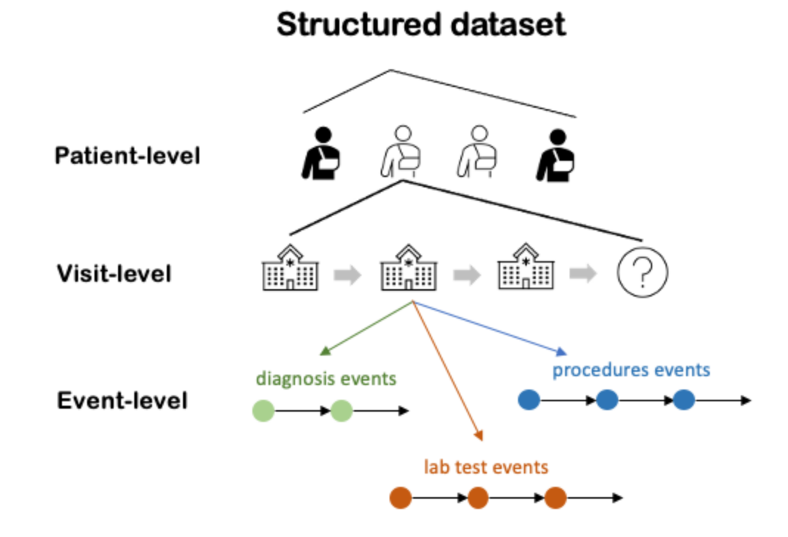

# **HW3_pyhealth_data**

## Overview

```pyhealth.data``` defines the basic ```Event```, ```Visit```, ```Patient``` structures used in the package. They are used to store the unstructured clinical features in a unified structured way, such that the information can be retrieved systematically.

This assignment is designed to get you familiar with the basic data structures in pyhealth. In the next pyhealth homework, we will teach a very useful follow-up tool based on the structures --- ```pyhealth.datasets```. pyhealth.datasets can help you process various EHR data effortlessly and you will consider using it in your final project.


```python
import numpy as np
np.random.seed(1234)

import utils
from pyhealth.data import Event, Visit, Patient
```

## **1. Play with basic pyhealth data structures**
- In week 2 PyHealth Lab reading, we have learned how to use the Event, Visit, Patient structures in ```pyhealth.data```.
    - refer to the tutorial at https://colab.research.google.com/drive/1y9PawgSbyMbSSMw1dpfwtooH7qzOEYdN?usp=sharing
    - refer to the document at https://pyhealth.readthedocs.io/en/latest/api/data.html

This question tests your understanding of the ```pyhealth.data``` module.


We randomly generate the unstructured Event, Visit, Patient data for 5 patients below.


```python
"""
Get patients from the database
"""
patients = utils.get_patients() # return five patients


"""
For Patients: load patient information 
"""
# patient_id
pat_id_ls = [pat.patient_id for pat in patients]

# patient birthdate
pat_birthdate_ls = [pat.birth_datetime for pat in patients]

# patient gender
pat_gender_ls = [pat.gender for pat in patients]

# patient location
location_space = ['Chicago', 'New York', 'Los Angles', 'Las vegas', \
                  'San Jose', 'Champaign', 'Boston', 'St. Louis', 'Seattle', 'other']
pat_location_ls = np.random.choice(location_space, len(patients), replace=True)


"""
For Visits: loaded features from the patients
"""
# visit_id for indexing the patient.
# structure: {patient_id}_{visit_id}
pat_visit_id_ls = [
    f'{v.patient_id}_{v.visit_id}'
    for pat in patients 
    for _, v in pat.visits.items()
]

# visit encounter_time
visit_encounter_time_ls = [
    v.encounter_time 
    for pat in patients 
    for _, v in pat.visits.items()
]

# visit hospital
hospital_space = ['MGH', 'OSF', 'Carl', 'Illini Smiles', 'Champaign Dental Group']
N_visits = len(visit_encounter_time_ls)
visit_hospital_ls = np.random.choice(hospital_space, N_visits, replace=True)


"""
For Events: loaded events from the visits
"""
# event_id for indexing the visit and patient.
# structure: {patient_id}_{visit_id}_{event_id}
pat_visit_event_id_ls = [
    f'{e.patient_id}_{e.visit_id}_{idx}'
    for pat in patients 
    for _, v in pat.visits.items()
    for idx, e in enumerate(v.get_event_list('DIAGNOSES_ICD'))
]

# event code
event_code_ls = [
    e.code
    for pat in patients 
    for _, v in pat.visits.items()
    for e in v.get_event_list('DIAGNOSES_ICD')
]

# event table 
N_events = len(event_code_ls)
event_table_ls = ['Prescriptions'] * N_events

# event vocabulary
event_vocabulary_ls = ['ICD9CM'] * N_events

# event time
event_timestamp_ls = [
    e.timestamp
    for pat in patients 
    for _, v in pat.visits.items()
    for e in v.get_event_list('DIAGNOSES_ICD')
]

# event prescription dosage
event_dosage_ls = [f'{240+inc}mg' for inc in range(N_events)]

patients = None
```

### TODO:  store the above information into a dict of Patient structure
- {id_1: patient_1, id_2, patient_2, ..., id_5, patient_5}


## 1.1 Store patient-level information

We first store the patient level information into the structure


```python
# initialize an empty dict
patients = {}

for pat_id, birthdate, gender, location in zip(pat_id_ls, 
                                               pat_birthdate_ls, \
                                               pat_gender_ls, 
                                               pat_location_ls):
    """
    We enumerate all patient information and create the corresponding patients.
    Hint:
        - use 
            Patient(
                patient_id = pat_id,
                ...
            )
    """
    patients[pat_id] = Patient(
        patient_id = pat_id,
        birth_datetime = birthdate,
        gender = gender,
        location = location
    )
    
    # your code here
    
```


```python
'''
AUTOGRADER CELL. DO NOT MODIFY THIS.
'''


```

## 1.2 Store visit-level information

we add the visit level information to each patient in ```patients```


```python
for pat_visit_id, encounter_time, hospital in zip(pat_visit_id_ls, \
                                        visit_encounter_time_ls, visit_hospital_ls):
    """
    We enumerate visit information and create the corresponding visits.
    Hint
        - use:
            Visit(
                visit_id = visit_id,
                patient_id = patient_id,
                ...
            )
    """
    # obtain the patient and visit id
    pat_id, visit_id = pat_visit_id.split('_')

    cur_visit = Visit(
        visit_id = visit_id,
        patient_id = pat_id,
        encounter_time = encounter_time,
        hospital = hospital
    ) 
    # your code here
    
    # add the current visit to the patient
    patients[pat_id].add_visit(cur_visit)
```


```python
'''
AUTOGRADER CELL. DO NOT MODIFY THIS.
'''


```

## 1.3 Store event-level information

we add the event level information to each patient in ```patients```
- HINT: remember to add events following the original order in the list.


```python
# link event to patient
for pat_visit_event_id, code, table, vocab, timestamp, dosage in zip(pat_visit_event_id_ls, \
                                                    event_code_ls, event_table_ls, event_vocabulary_ls, \
                                                    event_timestamp_ls, event_dosage_ls):
    """
    We enumerate event information and create the corresponding events.
    Hint
        - use:
            Event(
                visit_id = visit_id,
                patient_id = patient_id,
                ...
            )
        - Note that events in a visit is sorted by the event timestamp.
            Thus, event_id is optional when creating an Event.
    """
    # obtain the patient and visit id
    pat_id, visit_id, event_id = pat_visit_event_id.split('_')

    cur_event = Event(
        visit_id = visit_id,
        patient_id = pat_id,
        event_id = event_id,
        code = code,
        table = table,
        vocabulary = vocab,
        dosage = dosage,
        timestamp = timestamp
        
    )
    
    # your code here
    
    # add the current visit to the patient
    patients[pat_id].add_event(cur_event)
```


```python
'''
AUTOGRADER CELL. DO NOT MODIFY THIS.
'''


```

In the end, the unstructured data is stored in a way below (conceptually)





```python

```
